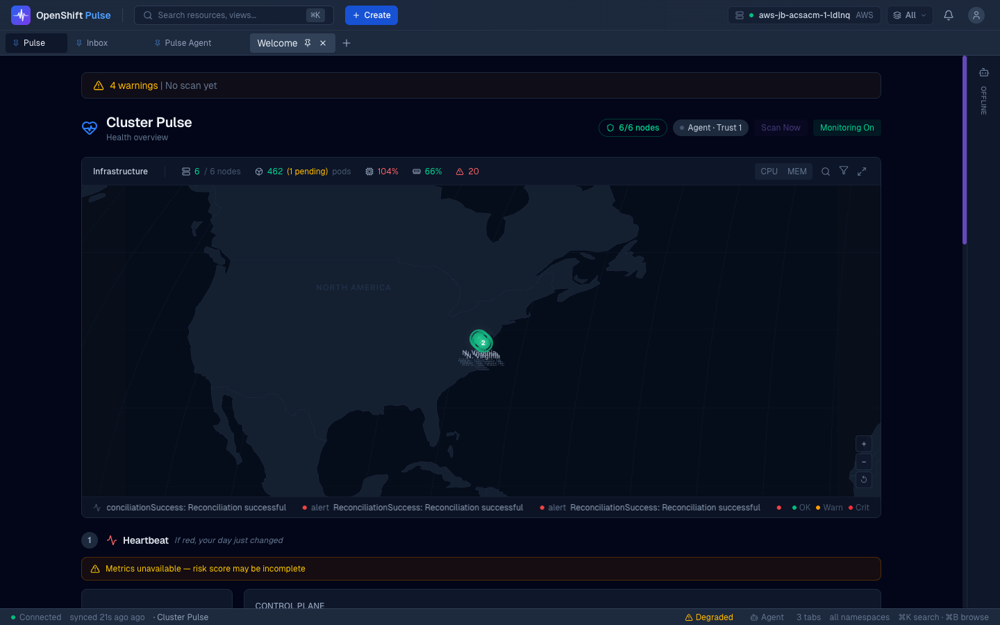
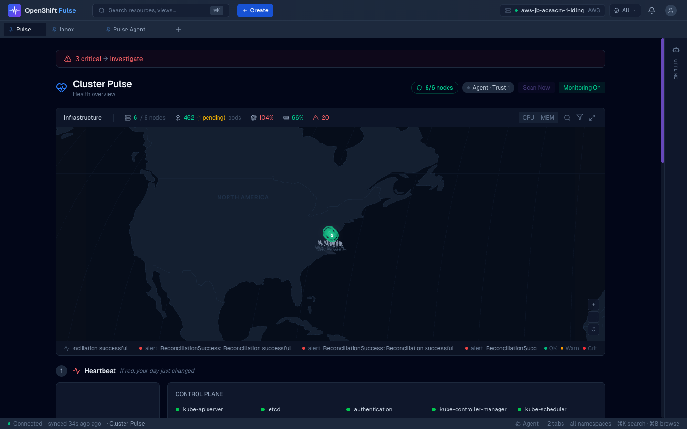
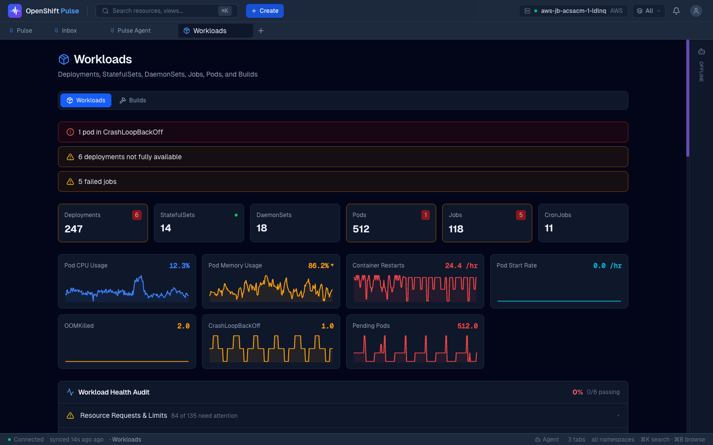
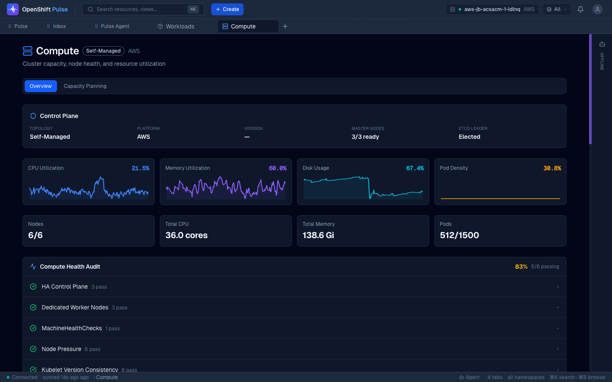
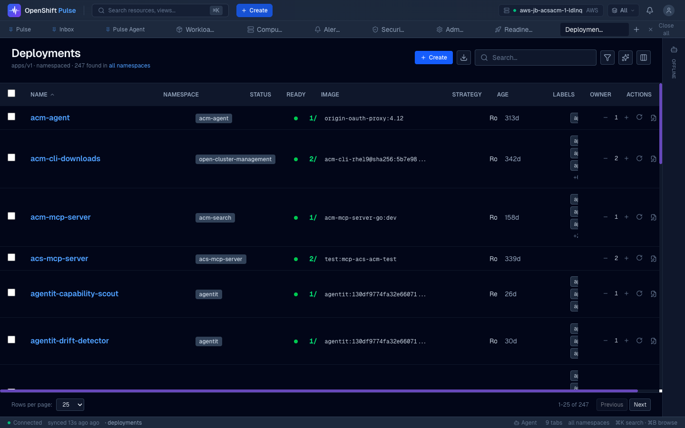
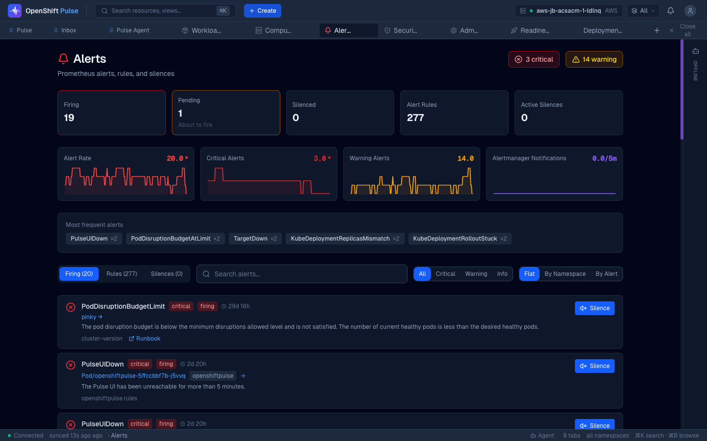
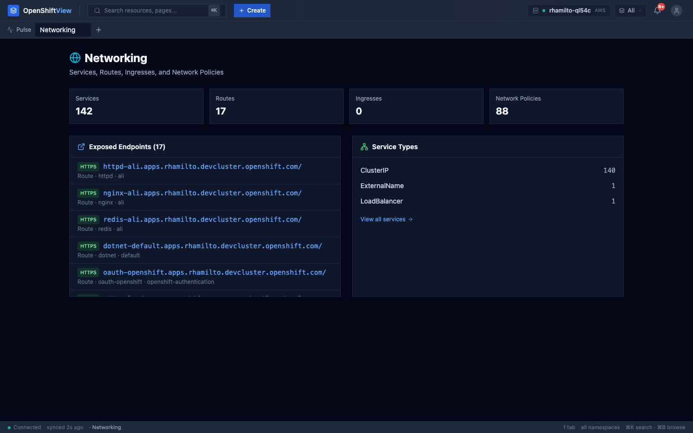
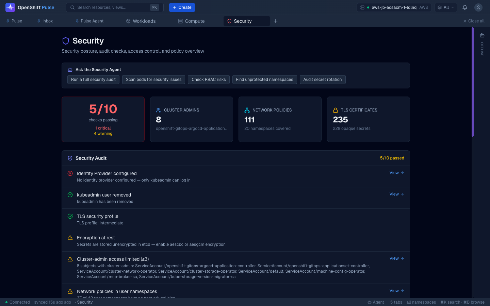
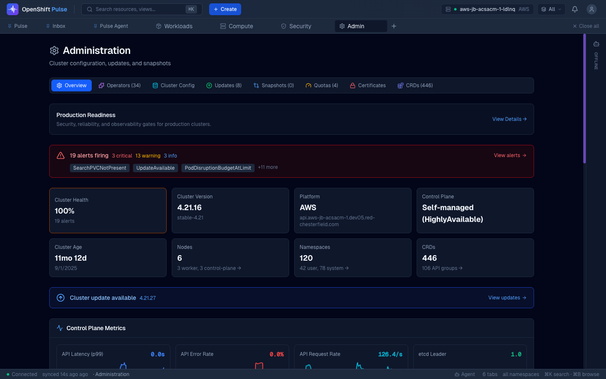

<p align="center">
  
</p>

<h1 align="center">OpenShift Pulse</h1>

<p align="center">
  <strong>Next-generation OpenShift Console for Day-2 Operations</strong><br>
  <em>Built for the platform engineer who checks their cluster at 8am Monday morning.</em>
</p>

<p align="center">
  <a href="https://github.com/PulseSRE/pulse-ui/releases/tag/v2.27.0"></a>
  
  
  
  
</p>

<p align="center">
  <a href="#install">Install</a> &bull;
  <a href="#-quick-start">Quick Start</a> &bull;
  <a href="#-screenshots">Screenshots</a> &bull;
  <a href="#-features">Features</a> &bull;
  <a href="API_CONTRACT.md">API Contract</a> &bull;
  <a href="SECURITY.md">Security</a> &bull;
  <a href="CHANGELOG.md">Changelog</a>
</p>

---

Real-time Kubernetes dashboard built with React, TypeScript, and WebSocket watches. Browse any resource type, see what needs attention, and take action — all through your cluster's OAuth. No external database. No agents to install. Just deploy and go.

### Why Pulse?

| | OpenShift Console | Lens | Rancher | **Pulse** |
|---|:---:|:---:|:---:|:---:|
| AI-powered SRE agent (Claude) | | | | **Yes** |
| Multi-cluster fleet dashboard | | | Yes | **Yes** |
| Cross-cluster search & comparison | | | Partial | **Yes** |
| Fleet compliance matrix | | | | **Yes** |
| 77 automated health checks with YAML fixes | | | | **Yes** |
| ArgoCD integration with auto-PR on save | | | | **Yes** |
| Incident correlation timeline | | | | **Yes** |
| Capacity planning with projections | | | | **Yes** |
| HyperShift / ROSA native | Partial | | | **Yes** |
| In-browser pod terminal | Yes | Yes | Yes | **Yes** |
| Zero install (OAuth SSO) | Yes | | | **Yes** |

---

## Install

**Install via the [pulse-operator](https://github.com/PulseSRE/pulse-operator)** — an OLM-managed Kubernetes Operator that deploys the full stack (this UI, [pulse-agent](https://github.com/PulseSRE/pulse-agent), and PostgreSQL) from a single `OpenShiftPulse` custom resource, with automatic upgrades, self-healing, and status conditions. See the operator's [README](https://github.com/PulseSRE/pulse-operator#install-via-olm) for the full CatalogSource → Subscription → CR walkthrough.

This repo builds the standalone UI container image the operator consumes (`quay.io/amobrem/openshiftpulse`) — you don't build or deploy it directly; the operator manages the Deployment, Route, OAuthClient, and RBAC for you. To point the operator at your own fork's image, set `spec.ui.image` on the `OpenShiftPulse` CR (no Helm values or manual manifests needed).

### Fork Checklist

If you're maintaining your own fork, here's what to change:

| What | Where | Default | Change to |
|------|-------|---------|-----------|
| **CI image push** | `.github/workflows/` | `quay.io/amobrem` | Your registry |
| **GitHub Pages** | `docs/index.html` | `PulseSRE.github.io` | Your GitHub Pages URL |

## Prerequisites

For local development (see [Quick Start](#-quick-start) below):

- **Node.js 24+** and **pnpm** — for building the UI
- **OpenShift 4.14+** or **ROSA** — with OAuth proxy support
- **oc CLI** — logged into target cluster

For a quick local image rebuild against an already-installed stack (see [Quick Redeploy](#quick-redeploy) below), you'll also want **Podman** or **Docker** and push access to a container registry.

## Quick Start

### Local Development

```bash
# 1. Install dependencies
pnpm install

# 2. Connect to your cluster
oc login https://api.your-cluster:6443
oc proxy --port=8001 &

# 3. Start dev server (rspack, hot reload)
pnpm dev    # http://localhost:9000
```

### Quick Redeploy

If the operator already has a stack running and you just want to test a locally-built UI image against it:

```bash
pnpm build && podman build --platform linux/amd64 -t ${PULSE_UI_IMAGE:-quay.io/your-org/openshiftpulse}:latest . \
  && podman push ${PULSE_UI_IMAGE:-quay.io/your-org/openshiftpulse}:latest \
  && oc patch openshiftpulse <cr-name> -n <namespace> --type=merge \
       -p '{"spec":{"ui":{"image":"'"${PULSE_UI_IMAGE:-quay.io/your-org/openshiftpulse}"':latest"}}}'
```

## Screenshots

<details>
<summary><strong>Click to expand 12 screenshots</strong></summary>

| | |
|---|---|
|  |  |
| **Welcome** — Quick navigation, cluster status | **Pulse** — Daily briefing, risk score, alerts |
|  |  |
| **Workloads** — Deployments, pods, health audit | **Compute** — Node metrics, CPU/memory |
|  |  |
| **Resource Tables** — Auto-generated, sortable | **YAML Editor** — Autocomplete, snippets, diff |
|  |  |
| **Alerts** — Severity filters, silence management | **Storage** — PVC health, capacity audit |
|  |  |
| **Networking** — Routes, policies, health audit | **Security** — Policy status, ACS detection |
|  |  |
| **Access Control** — RBAC audit, cluster-admin review | **Admin** — Operators, config, updates, quotas |

</details>

---

## Features

### At a Glance

| Category | What You Get |
|----------|-------------|
| **AI Agent** | Claude-powered SRE diagnostics and security scanning. 138 tools (102 native + 36 MCP), 7 skills (sre, security, view_designer, capacity_planner, plan_builder, postmortem, slo_management), 83 PromQL recipes, 10 runbooks, ORCA multi-signal routing (6-channel skill selector), dynamic UI rendering (25 component types), dashboard generation with semantic layout engine and auto-save to PostgreSQL, prompt caching, dynamic tool selection, cluster context injection, intelligence loop for continuous improvement. Follow-up suggestions after each response, welcome message on first connect. [pulse-agent](https://github.com/PulseSRE/pulse-agent) |
| **Predictive AI** | Live cluster-aware smart prompts: AI suggestions reflect actual issues (crash-looping pods, degraded operators, pending PVCs) not generic templates. Integrated into Command Palette (`?` mode), dock agent panel, and empty states. |
| **Native AI Layer** | Unified intelligence layer across all surfaces: smart prompts adapt to cluster state, AI query mode in Command Palette (`?`), violet-branded AI surfaces, auto-expanding InlineAgent for unhealthy resources, "Ask AI" buttons on PulseView attention items, first-run onboarding, dock notification dot for background insights |
| **Ask Pulse** | Natural language queries in Cmd+K — type a question, get AI-powered answers with action buttons. Dedicated WebSocket, falls back gracefully when agent is offline. |
| **Review Queue** | GitHub-PR-style view of AI-proposed infrastructure changes with YAML diffs, risk badges, and approve/reject actions. Now part of the Inbox task lifecycle (claim/investigate/resolve). |
| **Enhanced Pulse** | AI morning briefing card, overnight agent activity feed, incident-driven insights rail, cost trend sparkline. All backed by real cluster data. |
| **Ambient AI** | AI insights on every resource detail view, inline "Ask about this" agent, natural language table filters, dock agent panel, proactive background notifications, fleet-wide AI analysis |
| **Error Intelligence** | Structured PulseError classification (7 categories), actionable suggestions on every error toast, "Ask AI" button for agent-assisted diagnosis, error tracking store with persistence |
| **Multi-Cluster Fleet** | Fleet dashboard with health scores, cluster switcher (`Cmd+Shift+C`), cross-cluster search, compliance matrix, certificate heat map, RBAC comparison, config drift detection. Auto-detects ACM/MCE managed clusters. |
| **Cluster Health** | 77 automated checks (31 cluster + 46 domain) with YAML fix examples and "Why it matters" explanations. Actionable metrics: OOMKilled, CrashLoopBackOff, Pending pods, CPU throttling, Nodes Not Ready, API latency/error rate, etcd health. HyperShift-aware — hides control plane metrics unavailable on hosted clusters. |
| **Daily Briefing** | Risk score ring, control plane status, certificate expiry, attention items with remediation steps. "Cluster Zen" calm state when everything is healthy. |
| **Instant Navigation** | Hover-prefetch preloads view data before click — navigation feels instant with zero skeleton flash. Applied to Welcome tiles and Command Palette. |
| **Unified Inbox** | Consolidates Monitor findings, alerts, and predictions into a single worklist at `/inbox` with two views: **Inbox** (grouped tasks with presets — Needs Attention, Agent Cleared, My Items, Archived, All — plus filters and a task detail drawer) and **Activity** (chronological feed across Events, Alerts, Agent, Rollouts, Config). Full lifecycle: claim, acknowledge, snooze, dismiss, investigate, resolve, escalate, restore, pin. Trust controls are backend-capability-aware. |
| **Identity & Access** | Unified view merging User Management + Access Control into a single surface for users, groups, service accounts, RBAC audit, and impersonation |
| **Incident Timeline** | Unified timeline merging alerts, events, rollouts, and config changes with correlation groups |
| **Admin Overview** | Firing alerts, named degraded operators, cert warnings, quota hot spots, health score, and Agent quality gate status with PASS/FAIL emphasis — the 8am view |
| **ArgoCD / GitOps** | 4-step setup wizard (operator install → git config → first app → verify), sync badges, auto-PR on save, drift detection, Rollouts (canary/blue-green), Projects. GitHub, GitLab, Bitbucket. |
| **Capacity Planning** | predict_linear() projections for CPU, memory, disk, pods with days-until-exhaustion and trend charts |
| **HyperShift** | Auto-detects hosted control planes via infrastructure API. Cluster type badge, dedicated ClusterTypeSummary (NodePool counts vs master/etcd health), role-filtered hex map, adapted capacity planning queries, section ordering tuned per cluster type |
| **Production Readiness Program** | 30 gates across 6 categories (infrastructure, security, observability, reliability, operations, compliance). Wizard + checklist modes, blocking gates, waiver workflow, continuous re-checks on schedule |
| **Degraded Mode UX** | Standardized failure handling across all views — graceful degradation with inline error states, retry actions, and partial data rendering when APIs are unavailable |
| **Trust Escalation** | Confirmation dialog for agent trust level 3/4 escalation, preventing accidental grant of destructive capabilities |
| **Version History** | Custom view version history panel — browse, compare, and restore previous versions of agent-generated views |
| **Live Chart Refresh** | Charts auto-refresh with Live/Paused toggle indicator. Visual feedback for real-time vs. static data |
| **Custom Dashboards** | AI-generated views with 83 PromQL recipes, semantic auto-layout engine, view validator (dedup, schema, title quality), quality critic (0-10 scoring). Plan → Build → Critique → Present workflow. Clone, delete, version history, share. User-scoped with owner-based access control |
| **Tool Analytics** | Full tool call audit log (PostgreSQL), tool chain discovery (bigram analysis), usage stats API, token tracking per turn. Tools page with catalog, usage log, and analytics tabs — includes unused tools coverage chart for prompt optimization |
| **Feature Flags** | localStorage-based feature flag system with toggle UI in Admin. Gate unreleased features, A/B test surfaces, disable features without redeployment |
| **Security** | 10 audit checks incl. ACS/StackRox detection, HyperShift-adapted. [Full details](SECURITY.md) |

### Operations

| Feature | Details |
|---------|---------|
| **AI Agent** | Chat with Claude-powered SRE/Security agent (138 tools, 7 skills, 83 PromQL recipes, 25 component types). "Ask Agent" from any resource. Streaming, tool execution indicators, confirmation gates. Follow-up suggestions after each response, welcome message on first connect, capability change toast notifications. Mission Control at `/agent` with Trust Policy, Agent Health, Agent Accuracy, and Capability Discovery sections. |
| **Ask Pulse** | Natural language queries in Cmd+K: type a question in the Command Palette, get AI-powered answers with action buttons. "Open in Agent" for full conversations. |
| **Inbox Task Lifecycle** | PR-style review of AI-proposed changes as inbox tasks: YAML diffs, risk badges, business impact, approve/reject via claim/investigate/resolve actions. Live data from monitor WebSocket. |
| **Native AI UX** | Unified violet-branded intelligence layer: `?` in Command Palette sends to agent, smart prompts adapt to cluster state, "Ask AI" on PulseView attention items, auto-expand InlineAgent for unhealthy resources, AI empty state suggestions, first-run onboarding card, dock agent notification dot. |
| **Ambient AI** | AmbientInsight cards on pod/workload detail views. InlineAgent scoped conversations on every resource. NL table filters via AI-branded button. Agent dock panel accessible from any view. Background proactive notifications every 5 min. |
| **Rich Confirmations** | Visual confirmation cards with risk badges (LOW/MEDIUM/HIGH), impact preview, rollback info, keyboard shortcuts (Y/N/Esc). |
| **Deployment Rollback** | Revision history with container image diffs, one-click rollback |
| **Pod/Node Terminal** | WebSocket exec with command history, copy output, GitHub-dark theme |
| **Cluster Snapshots** | Capture state, compare field-by-field to find what changed |
| **Dry-Run Validation** | Server-side dry-run before applying YAML changes |
| **RBAC-Aware UI** | Actions disabled with explanatory tooltips based on SelfSubjectAccessReview |
| **User Impersonation** | Test as any user/SA — headers on all API calls, amber banner |
| **Real-time Watches** | WebSocket + 60s polling fallback via TanStack Query |

### Developer Experience

| Feature | Details |
|---------|---------|
| **YAML Editor** | CodeMirror with K8s autocomplete, schema panel, 71 snippets, inline diff |
| **Resource Creation** | 5 modes: Quick Deploy, Templates (30), Helm, Import YAML, Operators |
| **Operator Catalog** | 500+ operators, one-click install, 4-step progress tracking |
| **Smart Diagnosis** | 10 error patterns from pod logs with specific fix suggestions |
| **Auto-Generated Tables** | Sortable, searchable, j/k navigation, CSV/JSON export |

### Views (20 routable + 4 merged)

| View | Highlights |
|------|-----------|
| **Welcome** | Quick nav, cluster status with error recovery, all capabilities clickable, keyboard shortcuts |
| **Onboarding** | First-run setup flow for new clusters/users |
| **Pulse** | AI morning briefing, overnight agent activity feed, incident insights rail, cost trends. "Cluster Zen" calm state when healthy. Fleet mode: cluster health table, risk scores, AI analysis |
| **Agent** | Mission Control at `/agent` — Trust Policy, Agent Health, Agent Accuracy, and Capability Discovery |
| **Workloads** | Metrics + 6-check health audit, deployments sorted unhealthy-first |
| **Compute** | Node hex map with role filters, cluster type summary (HyperShift vs self-managed), capacity planning, machine management |
| **Storage** | PVC health, capacity audit, CSI drivers |
| **Networking** | Routes, network policies, ingress health |
| **Builds** | Now a tab in Workloads — BuildConfigs, ImageStreams, one-click trigger |
| **Access Control** | Now merged into Identity — RBAC audit (6 checks), recent changes |
| **User Management** | Now merged into Identity — Users/groups/SAs, impersonation, identity audit |
| **CRDs** | Now a tab in Admin — browse by API group, search, filter |
| **Security** | 10 checks, SCC audit, ACS detection |
| **GitOps** | 4-step setup wizard, ArgoCD Applications, sync history, drift, Rollouts (canary/blue-green), Projects |
| **Identity** | Unified view merging Users, Groups, Service Accounts, RBAC audit, and impersonation at `/identity` |
| **Inbox** | Unified worklist at `/inbox` — Inbox tab (grouped tasks, presets, filters, task detail drawer) and Activity tab (Events, Alerts, Agent, Rollouts, Config feed). Full lifecycle: claim, acknowledge, snooze, dismiss, investigate, resolve, escalate, restore, pin |
| **SLOs** | SLO/SLI registry with error budgets and burn-rate status per service |
| **Readiness** | Production readiness program — 30 gates across 6 categories, wizard + checklist modes, waiver workflow |
| **Fleet** | Multi-cluster dashboard, cross-cluster search, comparison, compliance, cert heat map |
| **Custom Views** | AI-generated dashboards at `/custom/:viewId`. Agent creates views via `create_dashboard` tool with metric cards, charts, and tables. Semantic auto-layout, version history, clone, delete, share. Plan → Build → Critique workflow |
| **Toolbox** | Consolidated tools hub at `/toolbox` — 8 tabs: Catalog (all 138 tools with native/MCP source badges), Skills (7 skill packages with status and routing config), Plans (plan templates and active executions), SLOs (SLO registry with burn rates), Connections (MCP server management with toolset toggles), Components (25 component kinds with mutation support), Usage (tool invocation audit log), Analytics (routing accuracy, fix strategies, agent learning) |
| **Project** | Namespace-scoped dashboard at `/project/:namespace` with resource summary and health overview |
| **Claim** | Share token claim view at `/share/:shareToken` for accepting shared custom views |
| **Admin** | 8 tabs: Overview, Operators, Config, Updates, Snapshots, Quotas, Certificates, CRDs. Updates tab has real-time upgrade progress and blocker detection: per-MachineConfigPool/per-node rollout status, evidence-based ETA from observed rollout rate, and stuck-update diagnosis (stale desiredUpdate mismatch, Upgradeable=False/admin-ack, conditional update risks, PDB/node drain blockers) with concrete remediation actions |

---

## Tech Stack

| | Technology | Why |
|---|-----------|-----|
| **Framework** | React 19 + TypeScript 5.9 | Type-safe, 50+ K8s interfaces |
| **Bundler** | Rspack 1.7 | Rust-based, ~1s production builds |
| **State** | Zustand + TanStack Query | Client + server state separation |
| **Real-time** | WebSocket watches | Instant updates, 60s polling fallback |
| **Styling** | Tailwind CSS 3.4 + Radix UI | Utility-first, headless components, CVA variants |
| **Testing** | Vitest + Playwright + Helm | 2,045 unit + 13 Helm + 57 E2E in ~9s |
| **Charts** | recharts + SVG sparklines | Rich charts with lightweight inline sparklines |
| **Security** | Red Hat UBI images | 0 CVEs, all images from Red Hat registries |

---

## Operator-Managed Stack

Once installed via the [pulse-operator](https://github.com/PulseSRE/pulse-operator) (see [Install](#install) above), the operator handles everything documented here as manual Helm steps in older versions of this README:

- **RBAC, OAuth, Route, OAuthClient** — reconciled automatically from the `OpenShiftPulse` CR; no `cluster-admin` Helm install step required from you directly (the operator's own installation needs cluster-admin once, via OLM).
- **Upgrades** — bump `spec.agent.image`/`spec.ui.image` on the CR; the operator tracks rollout health (`status.phase: Upgrading`) and automatically rolls back to the last known-healthy image if a new one doesn't become ready in time.
- **Self-monitoring** — a ServiceMonitor and PrometheusRules (`PulseAgentDown`, `PulseAgentHighRestarts`, `PulsePostgreSQLDown`) are deployed by default.
- **Session persistence** — OAuth cookie and client secrets are generated once and persisted in-cluster; you're never logged out by a redeploy.
- **Uninstall** — delete the `OpenShiftPulse` CR (`oc delete openshiftpulse <name> -n <namespace>`); the operator's finalizer cleans up cluster-scoped RBAC and the OAuthClient. See the operator's [Uninstall docs](https://github.com/PulseSRE/pulse-operator#uninstall) for removing the operator itself.

### Security

OAuth proxy with per-user auth. Non-root containers, read-only filesystem, CSP headers, TLS verification. 15/15 audit findings resolved. 0 package CVEs. All images from Red Hat registries. Secret rotation procedures documented. See **[SECURITY.md](SECURITY.md)** for full details.

<details>
<summary><strong>Troubleshooting</strong></summary>

Most RBAC/OAuth setup (`tokenreviews`/`subjectaccessreviews` grants, `user:full` scope) is now unconditionally re-applied by the [pulse-operator](https://github.com/PulseSRE/pulse-operator) on every reconcile, so it can't silently drift out of the correct state the way a one-time Helm install could. A malformed `cookie-secret` or Route/TLS drift specifically will also self-heal — check `oc get events -n <namespace>` for a `SelfHealed` event if you see either. The following are for issues the operator doesn't cover:

| Problem | Fix |
|---------|-----|
| Metrics blank (SSL error) | Use `service-ca.crt` (not `ca.crt`) for Prometheus/Alertmanager |
| Build stuck | Check configmap quota (`oc get resourcequota`) — need headroom (set >=50) |
| Pods not scheduling | Need 2+ nodes for topology spread constraints |

</details>

---

## Development

```bash
pnpm install         # Install dependencies
cp .env.example .env # Configure cluster URLs (optional)
oc proxy --port=8001 & # Start API proxy
pnpm dev             # Dev server on port 9000
pnpm test            # Run test suite
pnpm build           # Production build (~1s)
pnpm type-check      # TypeScript checking
pnpm verify          # Full check: types + lint + test + build
```

| Variable | Default | Description |
|----------|---------|-------------|
| `K8S_API_URL` | `http://localhost:8001` | K8s API proxy target |
| `THANOS_URL` | *(disabled)* | Thanos Querier for Prometheus metrics |
| `ALERTMANAGER_URL` | *(disabled)* | Alertmanager for alert management |
| `PULSE_AGENT_URL` | `http://localhost:8080` | Pulse Agent API server for AI diagnostics |

---

## Architecture

```
src/kubeview/
├── engine/              # Query, discovery, watch, snapshot, timeline
│   └── types/           # 50+ typed K8s interfaces
├── views/               # 18 views + admin tabs
│   └── admin/           # Overview, Operators, Updates, Snapshots, Quotas, Certificates, CRDs
├── components/          # Design system primitives, feedback, YAML editor, Terminal, Dock
│   ├── primitives/      # Button, Card, Badge, Tabs, Input, Tooltip, DataTable, StatCard, SectionHeader
│   ├── feedback/        # Toast, ConfirmDialog, ProgressModal, InlineFeedback
│   └── agent/           # MessageBubble, InlineAgent, AmbientInsight, ConfirmationCard, NLFilterBar, DockAgentPanel
├── hooks/               # useK8sListWatch, useCanI, useSmartPrompts, usePrefetchOnHover
├── store/               # Zustand (UI, cluster, fleet, agent state)
└── App.tsx              # Shell + routes (~45 lines)
```

```
Browser --> OAuth Proxy (8443/TLS) --> nginx (8080) --> K8s API / Prometheus / Alertmanager
                  |                                  \
          User's OAuth token forwarded               --> Pulse Agent (8080/WS) --> Claude API + K8s API
```

## Keyboard Shortcuts

| Shortcut | Action |
|----------|--------|
| `Cmd+K` | Command Palette |
| `Cmd+B` | Resource Browser |
| `Cmd+J` | Toggle Dock |
| `Cmd+.` | Quick Actions |
| `j / k` | Navigate table rows |
| `Esc` | Close overlays |

---

<p align="center">
  <strong>2,045 tests</strong> &bull; <strong>77 health checks</strong> &bull; <strong>~1s builds</strong> &bull; <strong>0 CVEs</strong> &bull; <strong>24 views</strong> &bull; <strong>138 AI tools</strong> &bull; <strong>7 skills</strong> &bull; <strong>25 component types</strong> &bull; <strong>500+ operators</strong>
</p>

<p align="center">
  <a href="https://github.com/PulseSRE/pulse-ui/releases">Releases</a> &bull;
  <a href="SECURITY.md">Security</a> &bull;
  <a href="CHANGELOG.md">Changelog</a> &bull;
  <a href="https://github.com/PulseSRE/pulse-ui/issues">Issues</a>
</p>

<p align="center">MIT License</p>
