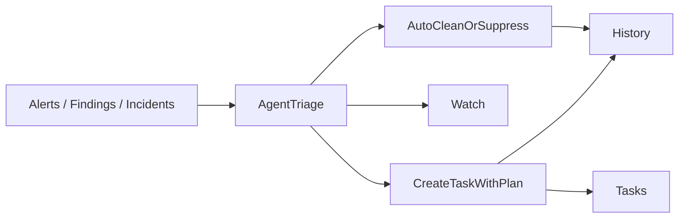

# Task-First Operations Design Spec

## Problem

The current inbox concept is trying to be too many things at once:

- a raw signal feed
- a review queue
- a task list
- an incident center
- a history surface

That causes deep conceptual and implementation problems:

- users click badges and links that do not land on the intended work state
- raw alerts and human work are mixed together
- multiple stores and APIs represent different slices of “the inbox”
- lifecycle states reflect system internals instead of user work
- history and current work compete for the same visual space

The result is that users cannot answer the simplest operational question quickly: what should I do next?

## Goal

Replace the mixed inbox model with a task-first operations model:

- raw alerts, findings, incidents, and drift are inputs to the agent
- the agent performs first-pass triage
- the agent either auto-cleans, suppresses, or converts a problem into a human task
- the main operational workspace shows only human-actionable tasks with an attached plan

The system should make these four questions obvious:

1. What should I do now?
2. What is the agent doing right now?
3. What already happened?
4. What raw signals exist?

## Core Product Rule

Nothing enters the primary work queue until the agent has already analyzed it and attached a concrete recommended plan.

A raw signal should never appear as a first-class row in the main task list.

## Information Architecture

The current inbox concept should be split into four distinct surfaces.

### Tasks

The default landing page and primary operational workspace.

This page contains only human work items that survived agent triage. Each item must already include:

- a clear title
- a problem summary
- a reason it matters now
- a recommended next step
- an agent-prepared plan

### Watch

A separate page for live agent activity.

This page shows:

- new signals being analyzed
- grouped incidents or problem clusters
- auto-remediations in progress
- suppressions or dedup decisions
- issues that may become tasks

Watch provides transparency into the agent’s behavior without polluting the work queue.

### History

A separate page for completed and historical operations activity.

This page includes:

- completed tasks
- auto-cleanups
- dismissals and suppressions
- rollbacks
- postmortems
- task execution and approval history

### Alerts

A separate raw observability surface.

This remains the place for direct signal inspection, but it is not the work queue and should not masquerade as a task surface.

## Recommended Navigation

Top-level operations navigation should become:

- `Tasks`
- `Watch`
- `History`
- `Alerts`

Legacy concepts should be folded into the new structure:

- `Inbox` -> `Tasks`
- `Reviews` -> a first-class `Needs Approval` view inside `Tasks`
- `Incident Center` -> removed as a separate mixed destination
- `Activity` -> `History`

## High-Level Flow

## Task Creation Model

### Agent pipeline before a task exists

Raw signals move through internal machine states before any user-facing task is created:

- `detected`
- `grouped`
- `analyzed`
- `auto_fixed`
- `suppressed`
- `escalate_to_task`

These are not task states. They belong to internal processing, `Watch`, and `History`.

### Rules for creating a task

A task should be created only when all of the following are true:

- human action is actually required
- the issue is not duplicate noise
- the issue was not already auto-fixed successfully
- the agent can explain the likely problem clearly
- the agent can propose a concrete next-step plan
- the issue has enough urgency or impact to justify interrupting a human

### Low-confidence behavior

If the agent is unsure, the issue stays in `Watch`.

Low-confidence situations should not create queue items. This is how the system keeps `Tasks` trustworthy.

## Task Object

Every task is a decision-ready work object.

### Required fields

- `id`
- `title`
- `summary`
- `whyNow`
- `scope`
- `priority`
- `status`
- `owner`
- `sourceSignals`
- `agentAssessment`
- `agentPlan`
- `recommendedNextStep`
- `riskLevel`
- `requiresApproval`
- `approvalReason`
- `confidence`
- `historyRef`
- `createdAt`
- `updatedAt`

### Scope

Scope should be explicit and structured, for example:

- cluster
- namespace
- workload
- resource list

### Source signals

Source signals should be references, not inline raw feed objects. A task can be derived from multiple correlated signals.

## Task Lifecycle

The visible task lifecycle should be human-centered, not machine-centered.

### User-visible statuses

- `ready`
- `accepted`
- `in_progress`
- `blocked`
- `waiting_for_approval`
- `done`

### Status meanings

- `ready`: task exists and is actionable but not yet accepted by a person
- `accepted`: someone owns it and intends to work it
- `in_progress`: active execution is happening
- `blocked`: progress is blocked by missing information, dependency, or external approval
- `waiting_for_approval`: the next step is known but gated
- `done`: work is complete

### States to remove from the user workflow

These should not be exposed as primary task states:

- `new`
- `triaged`
- `assessment`
- `agent_cleared`
- `acknowledged`

Those are pipeline or system concepts, not user task concepts.

## Reopen and Recurrence

If an issue recurs:

1. reopen the existing task if it is clearly the same unresolved operational problem, or
2. create a new linked task if it is a new recurrence wave after genuine completion

The system must not silently bury recurrence inside cleared or historical states.

## Ownership Model

Tasks are team-visible but person-ownable.

### Ownership rules

- unassigned work appears in the team queue
- accepting a task assigns it
- reassignment is explicit and audited
- approvals are explicit and audited
- task state should never imply hidden claim semantics

This keeps the queue collaborative while still making personal responsibility visible.

## Tasks Page Design

The `Tasks` page should behave like a workbench, not a feed.

### Default landing

Default landing view: `My Tasks`

### Built-in task views

- `My Tasks`
- `Team Queue`
- `Needs Approval`
- `Done`

### Summary strip

At the top of the page, show:

- Ready
- In Progress
- Blocked
- Needs Approval

These are operational workload summaries, not noisy signal counters.

### Filters

The page should support:

- owner
- priority
- cluster / namespace
- service / workload
- approval needed
- risk

Filters should act on real task fields, not overloaded semantics such as “claimed_by means source.”

## Task Row Design

Each row should show only the information needed to decide whether to open it:

- title
- one-line reason
- recommended next step
- priority
- owner
- scope
- approval badge
- confidence badge

Rows should not try to compress the full incident history into the list itself.

## Task Detail Design

The task detail view should answer questions in this order:

1. What happened?
2. Why did this become a task?
3. What does the agent recommend?
4. What should I do now?
5. What already happened before?

### Detail sections

- `Summary`
- `Plan`
- `Evidence`
- `Execution`
- `History`

### Primary actions

The main actions should be:

- `Accept`
- `Start`
- `Mark Blocked`
- `Request Approval`
- `Complete`
- `Reassign`

Avoid mixing in machine-oriented actions such as generic acknowledge/dismiss/archive semantics inside the main task flow.

## Approval Model

Approval should be a first-class task concept, not a fake filter or hidden pseudo-status.

### Approval behavior

- a task enters `waiting_for_approval` when the next step is known but gated
- the approval reason is always visible
- approval decisions are recorded in `History`
- `Needs Approval` is a real task view, not a redirect to a missing preset

## Watch Page Design

The `Watch` page should show what the agent is doing now, not what the human needs to do next.

### Content

- signals under analysis
- grouped issue clusters
- auto-remediation attempts
- suppressions / dedup decisions
- possible upcoming tasks

### Watch principles

- this page is informative, not the primary work queue
- users should be able to inspect agent reasoning without task pollution
- low-confidence issues stay here until they are concrete enough to become tasks

## History Page Design

The `History` page is the system memory of operational work.

### Content

- completed tasks
- auto-fixes
- suppressions / dismissals
- approvals
- rollbacks
- postmortems
- execution trail

History should not compete visually with current work. It is a separate surface because people answer a different question there.

## Alerts Page Design

The `Alerts` page is for raw observability and direct signal inspection.

### Principle

Alerts are not tasks.

They can lead to tasks after agent triage, but they should not appear in the primary work queue as unprocessed rows.

## Data Model Separation

Do not keep one overloaded schema trying to represent tasks, alerts, findings, and assessments simultaneously.

The system should use distinct models:

- `RawSignal`
- `AgentWatchEvent`
- `Task`
- `HistoryEvent`

The UI and backend should stop pretending that one “inbox item” can honestly serve all of those roles.

## Migration Strategy

This should be treated as a product migration, not a cosmetic rename.

### Keep

- shared operational workspace
- agent-prepared context and plans
- ownership
- approval flows
- audit trails

### Delete or demote

- inbox as a mixed object bucket
- raw signal rows in the main queue
- fake preset routes
- machine-only user states
- overlapping incident-center language
- duplicate state systems representing the same queue

### Migration phases

#### Phase 1: Route and naming cleanup

- `/inbox` -> `/tasks`
- `/reviews` -> `/tasks?view=needs-approval`
- incident/history aliases -> explicit `History` or `Alerts`

#### Phase 2: Backend contract split

Introduce separate models and APIs for:

- raw signals
- watch events
- tasks
- history events

#### Phase 3: Agent-only task creation

Move all task creation behind the agent pipeline so raw signals never bypass triage.

#### Phase 4: Delete hybrid leftovers

Remove:

- invalid presets
- mixed item-type assumptions
- stale incident-center views and routes
- duplicate counters sourced from unrelated stores

## Success Criteria

The redesign is successful if a user can answer these questions immediately:

- What should I do now? -> `Tasks`
- What is the agent doing? -> `Watch`
- What already happened? -> `History`
- What raw signal exists? -> `Alerts`

If one screen tries to answer more than one of these by default, the design is drifting back toward the current failure mode.

## Verification

### Product verification

1. `Tasks` contains only human-actionable items with plans
2. no raw alerts or findings appear as first-class task rows
3. `Needs Approval` is a real task view
4. `Watch` shows live agent triage and auto-remediation behavior
5. `History` shows completed work and audit trails
6. `Alerts` remains the raw signal surface

### Technical verification

1. route aliases resolve to real destinations
2. URL state matches visible task views
3. task detail always refreshes against current source of truth
4. recurrence handling either reopens or relinks tasks explicitly
5. ownership, reassignment, and approval actions are audited
6. UI counters are derived from the canonical task model, not from mixed stores

## Recommendation

The recommended product direction is:

- rename `Inbox` to `Tasks`
- keep `Watch` as a separate destination, not a side rail
- treat raw alerts/findings/incidents as inputs to the agent
- make the task queue contain only agent-reviewed work with attached plans

This is the cleanest path to replacing the current confused hybrid with a product users can reason about quickly.